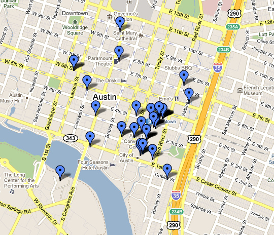

 <small class = "float-left">Foto by [RachelC](https://www.flickr.com/photos/rachelc/5539886849)</small>

Projekt Goal: Develop a Web & Mobile App to plan little explorations either
by foot, bike or car including pre-selected locations or locations suggested by peers.

Offered as a (Praxisprojekt for IMI Bachelors)[https://imi-bachelor.htw-berlin.de/studium/projekte/projekte-im-sommersemester-2015//]. See the scenarios and
user stories below for a rough idea what the apps should support.

Scenarios
-----------------------------------------------------------------

### Scenario 1

Deniz rides home on their bike and has an hour of extra time, the sun is shining so they decide to use that hour to visit a place they have wanted to visit (wasn't there this
special bakery somewhere close to the route?) so they start the Treasure Map App, enter the planned destination and available extra time - and get a list of locations they have selected
for visiting earlier that can be reached within the given time limit. They can switch to a map view and drag the direct route to include one
or more of these locations, can immediately see the duration of their detour and thus easily and especially without using a great amount of time nor several applications decide on a new
alternate route to include one or more places to visit in their ride home. The bakery was great, so back home Janis writes a sentence our two about their visit and attachs a photo.

### Scenario 2

Kaj wants to visit Hamburg. They have never been there, so they use Treasure Map at home on their desktop computer to browse sights, geocaches and locations marked by their treasure map buddies as interesting to plan their visit to Hamburg.
Later, they can easily create routes for walking or cycling that include several of these locations and are supported en route by their smartphone, which they can also use to take
photos en route and attach to the visited locations on Treasure Map.

Possible Backlog / User Stories
-----------------------------------------------------------------
- a user can browse locations from several selected sources
  (e.g. Wikipedia or entered/marked by friends) and mark them as "want to visit"
- a user can use their phone to quickly find nearby locations they want to visit
- a user can see actions of friends on the start pages, e.g. places they want to visit or have visited
- the notion of "near" to find locations to visit can be easily adjusted between 5 min walk and several hour drive
- the user can comment on places visited
- a user can upload pictures for places visited
- the user can find locations within a detour of a route
- the user can mark visited places to visit again
- sites can be filtered to show content provided by all users, friends or just the user themselves
- users can enter information about places they want to visit and choose to keep them private or just share them with friends
- ....

System Design / Technology
-----------------------------------------------------------------

The application should be a combined web and mobile app
allowing routing on the mobile device. This leaves several options for
the actual design, but will most probably involve a HTML 5 Website, an
restful API in front of some sort of data storage and maybe a
dedicated mobile app or even two, or an HTML5 site that is suitable for mobile use.

Preliminary Project Plan
-----------------------------------------------------------------
- collect and evaluate possible sources for location / travel information
- collect and evaluate technologies and sketches for the system design
- depending on the team size, split up the team to develop different components
(back end, web site, mobile app)
- actual development
- user tests (acceptance / usability)
- further development

Similar or possibly useful projects
-----------------------------------------------------------------

### Some Possible Data Sources
* [Wikipedia](https://wikipedia.de) contains articels about many locations, including countries, [cities](https://de.wikipedia.org/wiki/Berlin), villages, sights or special buildings.

* [WIWOSM on Wikimedia Tool Labs](https://wiki.openstreetmap.org/wiki/WIWOSM) "WIWOSM (Wikipedia where in OSM) is a project to show for a Wikipedia article geometric objects from OpenStreetMap. These objects have a matching wikipedia=* tag. The usage of WIWOSM will be primarily at maps inside Wikipedia (OSM-Gadget and WikiMiniAtlas). (Still moving from Toolserver.)"

* [Geocaching](https://en.wikipedia.org/wiki/Geocaching) - one of the first [location based games](https://de.wikipedia.org/wiki/Location-based_Game); Geocaches could be a place to visit by themselves but also point to interesting places to visit, e.g. [Lost Places](https://de.wikipedia.org/wiki/Lost_Place).

* [Wikitravel](https://wikitravel.org/en/Main_Page) - a crowdsourced worldwide travel guide that seems to lack maps.

### Some Related Projects/Sites

* [Komoot](https://www.komoot.de/), [Vodafone Blog Article about Komoot(german)](https://blog.vodafone.de/lifestyle/komoot-outoor-touren-fuer-abenteurer/) supports planning tours and has user generated "Highlights". Users can follow each other, and share their "adventures" with other users. Sharing some ideas with the "Treasure Map" project idea, it focuses on outdoor hiking and cycling and does not allow to import location data from other sources.

* [GPSies](https://www.gpsies.com) - a site and mobile apps to share hiking, running and cycling routes

* [Foursquare](https://foursquare.com) Provides crowdsourced information about different kinds of places, mostly urban (Food, Outdoors, Shopping, Coffee, Nightlife, Entertainment) Its former functionality to share your current location with peers has been moved to a seperate app, called [Swarm](https://de.swarmapp.com), which still enables Foursquare to show wich peers have visited a certain location.

* [Tripadvisor](https://www.tripadvisor.de), is a plattform containing user-generated trip reviews, but also information about "Attractions"

### Not related
* [NSA Treasuremap](https://www.spiegel.de/netzwelt/netzpolitik/nsa-wie-der-geheimdienst-mit-dem-system-treasuremap-daten-sammelt-a-991496.html#)
