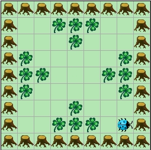
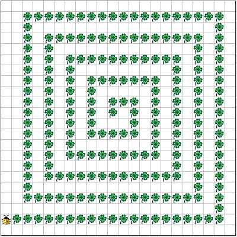

## Pre-Lab

1.    [Download the Scenarios][1] and read through the Kara programming exercises in the assignment.
2.   Write down how Kara could solve the task for each one of them. For example, if the programming exercise was Exercise 4 from Worksheet 1, where Kara was to move in a Square and drop a leaf in each corner, you could write down something as this:
         1.  walk one edge (call move n times),
         2.  drop a leaf
         3.  turn right
         4.  repeat that 4 times
3.   Don&#8217;t worry if you don&#8217;t know yet how to really program Kara to solve the problems, we will learn new things in the lecture that will help you to do so! Just try to think of a way Kara could solve them knowing the methods Kara has, and write down a solution with your own words or draw a diagram.
4.   When designing the algorithms, think of useful methods that help you/make your tasks easier and name them/use them in your algorithm description.

## Assignment

[Download the scenario for these exercises][1] if you haven't already done so for the prelab. It contains a KaraWorld and a Kara for each programming task. Solve all Programming Exercises using this scenario, and upload the whole scenario as a zip file. For all problems, make sure to extract methods where appropriate to make the source code more readable.

1. With lab01_kara01: Using an integer variable, make Kara lay down 10 leaves in the middle lane.
2.  Kara in the Tunnel: (lab01_kara02): Kara is afraid of Tunnels. When entering the tunnel, Kara is scared and drops a leaf; and she immediately stops after leaving the tunnel. Note that &#8220;in the tunnel&#8221; means that there is a tree on both sides, not just on one.
3.  Leaves in the forest I: (lab01_kara03): Building on Exercise 7 of Worksheet 1, where Kara looks for a leaf in front of him, modify the algorithm to make him able to walk around 2 or more trees in a row.
4.  Leaves in the forest II (lab01_kara04): In this forest, each field has exactly two free fields, one of them behind Kara, and the other one either to the left, in front or on the right. Make Kara move through the forest and find the leaf.
5.  Picture Inversion: (lab01_kara05) Program Kara such that it will create an &#8220;inverse picture&#8221; within a tree rectangle. E.g. starting as in KaraWorld05, the picture should look like this after the program has run:

6.  Draw a Spiral: (lab01_kara06) Like this:

## Post-Lab, AKA What to Turn In

Please upload 2 Files to Moodle:

1.  A PDF with your Lab Report, containing your answers to the Pre-Lab. You can order them as you like, e.g.
    combine the algorithm sketched in the prelab with the algorithm that actually worked in the lab rather than having a section "prelab" and "lab report".
2.  The Scenario with your solutions in each Kara&#8217;s act method as a ZIP file.

Read the info on the [Lab Index]() page again if you're unsure about the nature of the lab reports - or simply ask!

 [1]: https://github.com/htw-imi-info1/exercise01-kara
